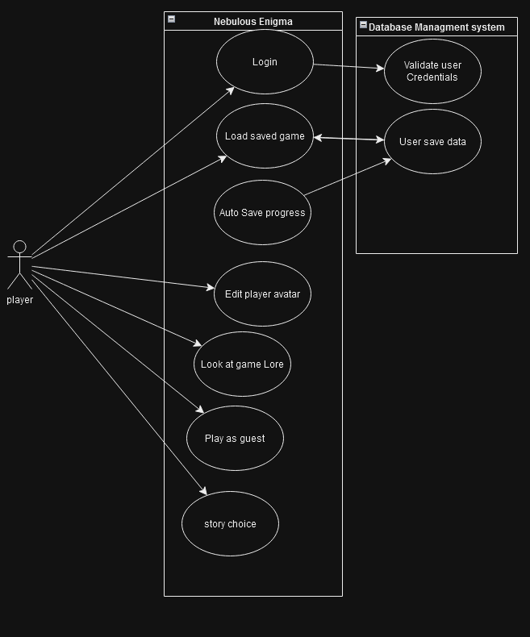
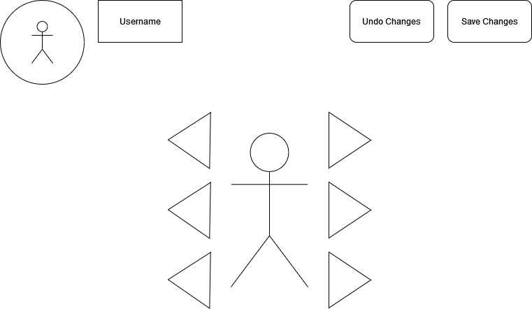

# 1. Positioning

Group 01 – *“Nebulous Enigma”*

Group Members: Ciaran Wham, Kameron Napier, Levi Ly, Isaac Schwarz, Collin Boyer, Kayden Vicenti

### 1.1 Problem statement

The problem of non-linear story games with choices that don't actually matter affects gamers and visual novel fans; the impact of which is wasting players' time and money on boring games that fail to meet expectations. 

### 1.2 Product Position Statement

For all levels of gamers and visual novel fans who are interested in sci-fi, Nebulous Enigma is a "choose your own adventure" game that lets players experience their own story and make choices that matter; unlike other story games that follow a largely linear plot and give an illusion of choice.

### 1.3 Value proposition and customer segment

Value proposition: Nebulous Enigma is a "choose your own adventure" game that allows players to experience an exciting sci-fi story the way they want, providing an entertaining and easy-to-play adventure.

Consumer segment: All levels of gamers and visual novel fans who are interested in sci-fi

# 2. Stakeholders

# 3. Functional requirements (features)

1. Each story page presents a paragraph of text telling the player what is going on.
2. The player can select different paths to progress the story differently.
3. The player can create an account.
4. The game prompts the player to log in, sign up, or play as a guest before they start playing.
5. If the player is logged into an account, their progress is saved as they play to a database server.
6. The game must have multiple endings.
7. The game must be able to run in a web browser.
8. The game is played with a mouse or touch input on a touchscreen.

# 4. Non-functional requirements

1. Time Behavior - Going from one page to another page must take less than 500ms. 
2. Learnability - At least 4 out of 5 players are able to navigate the website and play the game without outside assistance.
3. User Enganement - At least 4 out of 5 players are satisfied with the story.
4. User Engagement - At least 4 out of 5 players are satisfied with the customization available to the player.
5. User Engagement - At least 4 out of 5 players are satisfied with the lore page that displays extra information about the world of the game.
6. User Engagement - At least 4 out of 5 players are satisfied with the achievements they can collect through playing the game.
7. User Engagement - At least 3 out of 5 players submit feedback using the website's feedback page.
8. User Engagement - At least 4 out of 5 players are satisfied with using the discussion page to ask, answer, and see questions related to the game.
9. User Engagement - At least 4 out of 5 players are satisfied with the soundtrack and sound effects.
10. User Engagement - At least 4 out of 5 players are satisfied with the story flow chart page.
11. Inclusivity - At least 4 out of 5 colorblind players are satisfied with the colorblind settings available.
12. Interoperability - The player can play on the same account and have their progress saved across different devices and browsers.
13. Reusability - At least 9 out of 10 story pages follow the same basic template where the text, background, and choices can be easily edited.
14. Faultlessness - Players experience less than 1 error per hour while playing.

# 5. MVP

# 6. Use cases

### 6.1 Use case diagram

### 6.2 Use case descriptions and interface sketch

### *Use Case 1: Make a story choice*
**Actor:** Player\
**Trigger:** The player wants to perform an action in the story.\
**Pre-conditions:** The player is at a branching point of the story.\
**Post-condition:** The player progresses to the next part of the story.

**Success Scenario:**

1. The system presents a number of options to progress the story.
2. The player selects an option.
3. The system saves the selected option.
4. The system displays the next story page. 

**Alternate Scenarios:**

*3a. The system is unable to save.*
1. The system notifies the player that progress is unable to be saved.
2. The system allows the player to continue playing without save functionality.

*4a. The system is unable to access the next story node.*
1. The system notifies the player of the error and asks them to try again later.

### *Use Case 2: Load progress*
**Actor:** Player\
**Trigger:** The player wants to load their save file from a previous playthrough.\
**Pre-conditions:** The player has a save file and is at the starting screen of the game.\
**Post-condition:** The player is redirected to their save point. 

**Success Scenario:**

1. The system presents an option to load a save.
2. The player enters their email and password.
3. The system redirects the player to the point in the game where they last saved.

**Alternate Scenarios:**

*2a. The log-in information is invalid.*
1. The system tells the user that their log-in information is invalid.
2. The system displays the start screen.

*3a. The save data is unusable by the system.*
1. The system notifies the player of this error.
2. The system redirects the player back to the start screen.

### *Use Case 4: Create discussion post*
**Actor:** Player\
**Trigger:** The player wants to create a post in the discussion.\
**Pre-conditions:** The player is logged in and on the discussion page.\
**Post-condition:** The system displays the discussion post. 

**Success Scenario:**

1. The player navigates to the discussion page.
2. The player selects post creation.
3. The system prompts the user to enter a post title and body.
4. The player enters the post details.
5. The player submits post.
6. The system creates a page for the post and adds it to the discussion page.
7. The system redirects the player to their created post.

**Alternate Scenarios:**

*5a. The player provided an invalid input to the title and body fields.*
1. The system notifies the player that their input was invalid. 
2. The system allows the player to fix the invalid fields and resubmit.

*5b. The system is unable to create a new post.*
1. The system notifies the player of the error and asks them to try again later.

Mock up ~ coming soon...

### *Use case 5: Customize avatar*
**Actor:** Player\
**Trigger:** The player wants to customize their avatar.\
**Pre-conditions:** The player is logged in and viewing their profile.\
**Post-condition:** The player's avatar is saved and displays in-game.\

**Success scenario:**
1. The system displays options to customize the avatar's head, torso, and legs.
2. The player selects customization options.
3. The player submits changes.
4. The system saves their avatar.
5. The system redirects the player to their profile.

**Alternate Scenarios:**

*3a. The player leaves without submitting changes.*
1. The system does not save their avatar.

*4a The system fails to save changes.*
1. The system notifies the player of the error and asks them to try again later.

### *Use Case 6: Play as a guest*
**Actor:** Player\
**Trigger:** The player wants to play without logging in to an account.\
**Pre-conditions:** The player is on the main menu.\
**Post-condition:** The player is on the first page of the story.

**Success Scenario:**

1. The system displays options to log in, sign up, or play as a guest.
2. The player selects the guest option.
3. The system logs the user into the guest account.
4. The system displays the first story page. 

**Alternate Scenarios:**

*3a. The system is unable to log the player into a guest account.*
1. The system notifies the player that they are unable to log in.
2. The system requests the player to try again.

*4a. The system is unable to access the story.*
1. The system notifies the player of the error and asks them to try again later.

# 7. User stories

1. As a player, I want to customize my character, so that my playthroughs feel unique. (Priority: 9, Estimation: 5 days)
2. As a player, I want to return to previous choices I've made, so that I can experience other paths of the story. (Priority: 2, Estimation: 6 hours)
3. As a player, I want to read a good story, so that I am entertained. (Priority: 2, Estimation: 2 weeks)
4. As a player, I want to read multiple endings, so that I can learn more about the game's world. (Priority: 2, Estimation: 6 days)
5. As a new gamer, I want to post my questions about the game, so that I can understand how to navigate this game. (Priority: 10, Estimation: 4 weeks)
6. As a player, I want resolved posts to be marked as such, so that it is easier to find answers. (Priority: 10, Estimation: 1 day)
7. As a player, I want to be able to go back to the previous page, so that I don't miss details. (Priority: 4, Estimation: 4 hours)
8. As a player, I want to play without logging in, so that I don't have to make an account. (Priority: 3, Estimation: 1 hour)
9. As a science fiction fan, I want a story and visuals that support the fantasy of science fiction, so that I feel immersed. (Priority: 3, Estimation: 6 weeks)
10. As a colorblind person, I want a colorblind mode, so that the game is more accessible to me. (Priority: 12, Estimation: 5 Days)
11. As a player, I want to see the percentage of players that get each ending, so that I feel more of a sense of community. (Priority: 7, Estimation: 3 days)
12. As a player, I want to hear sound effects and music, so that I feel more immersed. (Priority: 8, Estimation: 2 days)

# 8. Issue Tracker
